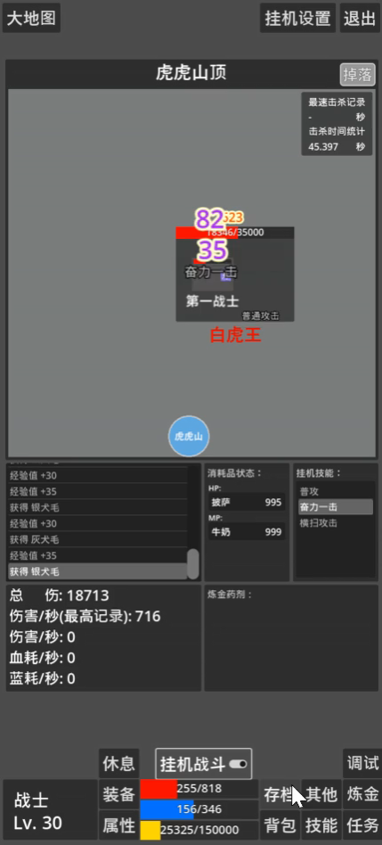
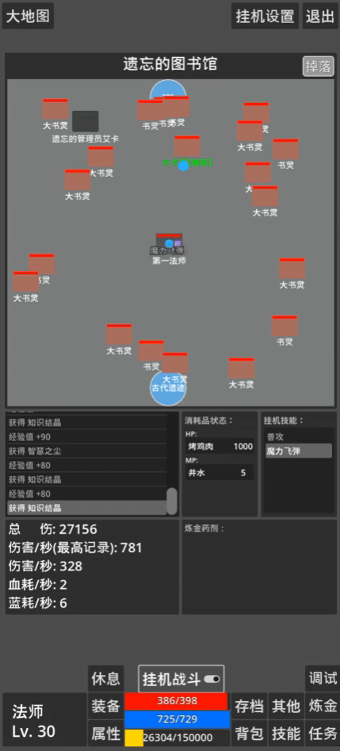
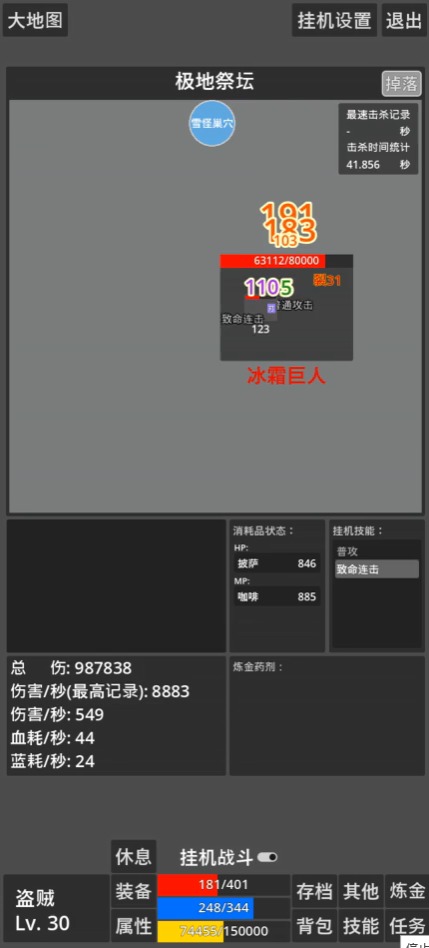
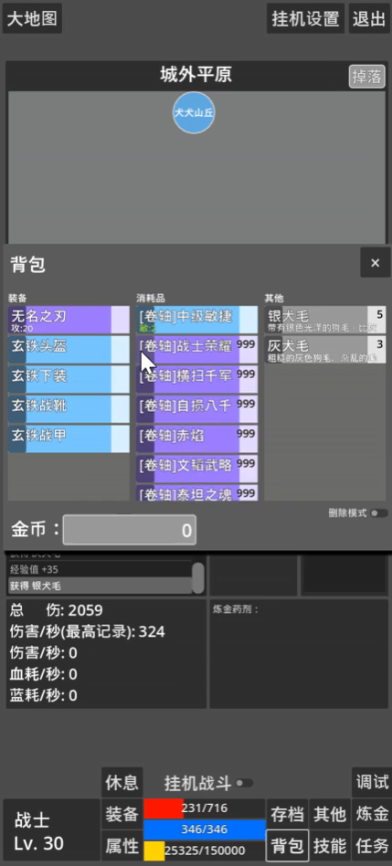
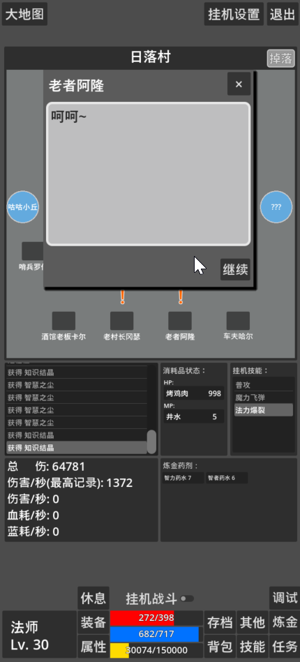

# TextMapleStory

文字冒险

## 1. 项目介绍
### 特色
纯文字、RPG、战法盗三职业、挂机、刷装备、刷词条卷轴、剧情。

### 开发工具
- 开发语言：GDScript
- 开发环境：Godot 4.4

## 2. 项目展示

### 战士展示
[](./example/战士展示.mp4)

### 法师展示
[](./example/法师展示.mp4)

### 盗贼展示
[](./example/盗贼展示.mp4)

### 卷轴展示
[](./example/卷轴展示.mp4)

### 剧情展示
[](./example/剧情展示.mp4)


## 3. 项目结构
```text
textmaplestory/
├── assets/
│   └── config/		# 游戏相关内容的配置文件
│   └── icon/		# 游戏图标
├── docs/
│   └── design/		# 游戏设计文档
├── src/			
│   └── core/		# 游戏核心逻辑层代码
│   └── scenes/		# 游戏场景层代码
│   └── test/		# 测试代码
│   └── util/		# 工具类代码
├── dev_log.md		# 开发日志
├── README.md		# 项目说明
├── release/		# 游戏发布相关
└── LICENSE			# 项目许可证
```

## 4. 交流沟通
邮箱: 675683354@qq.com
QQ群：1049980754

