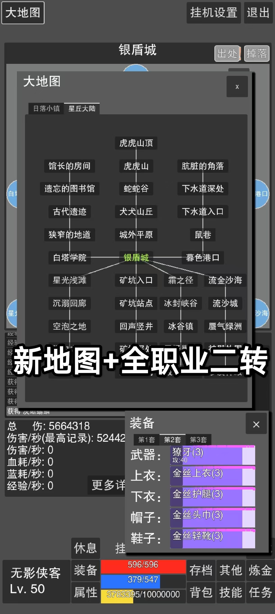
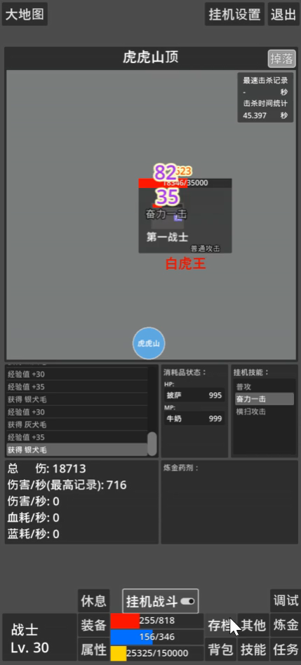
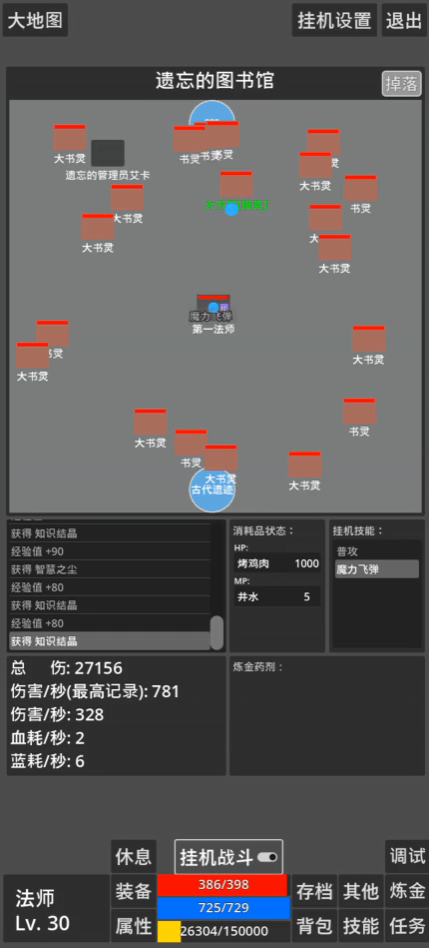
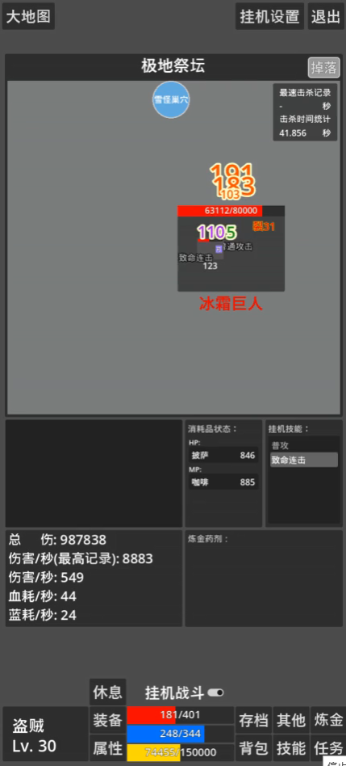
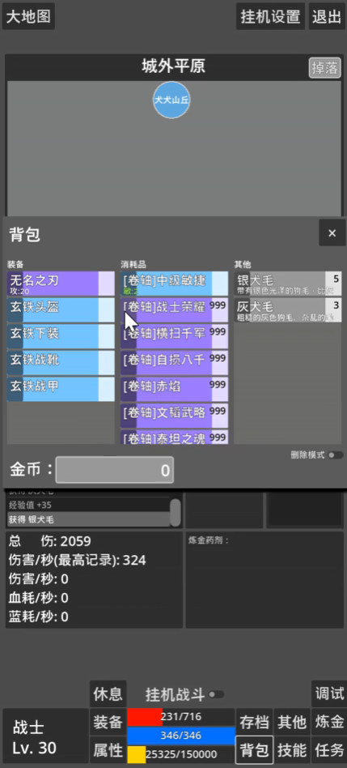
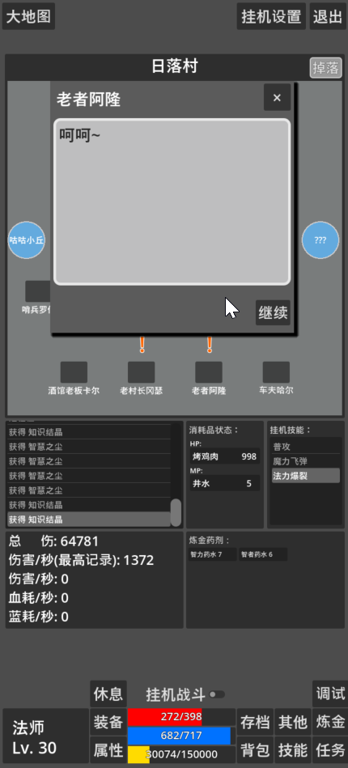

# TextAdventure

文字冒险

## 1. 项目介绍
### 特色
纯文字、RPG、战法盗三职业、挂机、刷装备、刷词条卷轴、剧情。

### 开发工具
- 开发语言：GDScript
- 开发环境：Godot 4.4

## 2. 项目展示

### 2.0.0版本更新展示
[](./example/2.0.0版本更新.mp4)

### 战士展示
[](./example/战士展示.mp4)

### 法师展示
[](./example/法师展示.mp4)

### 盗贼展示
[](./example/盗贼展示.mp4)

### 卷轴展示
[](./example/卷轴展示.mp4)

### 剧情展示
[](./example/剧情展示.mp4)


## 3. 项目结构
```text
textmaplestory/
├── assets/
│   └── config/		# 游戏相关内容的配置文件
│   └── icon/		# 游戏图标
├── docs/
│   └── design/		# 游戏设计文档
├── src/			
│   └── core/		# 游戏核心逻辑层代码
│   └── scenes/		# 游戏场景层代码
│   └── test/		# 测试代码
│   └── util/		# 工具类代码
├── dev_log.md		# 开发日志
├── README.md		# 项目说明
├── release/		# 游戏发布相关
└── LICENSE			# 项目许可证
```

## 4. 游戏版权
本游戏采用最宽松的MIT开源协议，您可以在遵守协议的前提下任意使用、修改、分发本游戏。
同时作者也非常鼓励大家进行二次开发。

## 5. 交流沟通
个人邮箱: 675683354@qq.com
QQ群：1049980754
二群：87659837

## 6. 捐赠渠道
如果我的开源工作让你收获了一份快乐或者帮助，并且你有能力和意愿，你可以选择资助我，这份资助对我来说很重要，我需要用它过渡到全职游戏开发者的阶段，有更多精力去做更多有意思的游戏。
[第三方捐赠渠道](https://www.jilvfaka.com/links/3F4CA33527F4DA9D)
或者您可以直接联系我
QQ：2503293039


