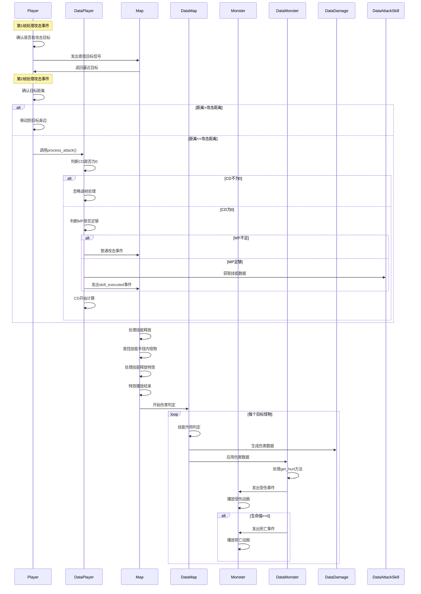

# 战斗系统设计

## 战斗流程

### 1. 一次最简单的攻击流程

涉及到的类

- Player
- DataPlayer
- Map
- DataMap
- Monster
- DataMonster
- DataDamage
- DataAttackSkill

流程说明：
1. Player的第1帧，处理攻击事件。
2. Player开始确认自身是否已经存在攻击目标，如果不存在，则发出查找目标的信号。
3. Map类监听到Player发出的查找目标的信号，找到最近目标作为Player的攻击目标。
4. Player的第2帧，处理攻击事件。
5. Player确认自身存在攻击目标，判断目标和自身距离，如果大于攻击距离，则移动到目标身边。
6. Player如果和目标的距离小于等于攻击距离，则调用DataPlayer的process_attack方法。
7. DataPlayer的process_attack方法判断当前执行CD是否为0，如果不为0，则无法攻击，忽略该帧处理。如果为0，则进一步判断。
8. 获取当前技能的MP消耗，判断当前MP是否足够，如果不足，则使用普通攻击发出攻击事件，否则使用技能(DataAttackSkill)发出攻击事件(skill_executed)。
9. 发出攻击事件后，CD开始计算。
10. Map类监听到DataPlayer发出的skill_executed事件，开始处理技能释放。
11. Map类开始查找技能半径范围内的怪物，按照距离从小到大排序，取前count(技能作用目标数量)个怪物作为技能目标。
12. Map类开始处理技能技能释放特效（如果没有则直接进入下面的伤害判定阶段）
13. 技能释放特效开始播放，播放结束后，进入伤害判定阶段。
14. Map类开始处理伤害判定方法，遍历每一个Monster类，执行DataMap类的技能作用判定方法
15. DataMap类开始处理技能作用判定方法，根据攻击力，技能伤害系数，各种特殊效果加成，目标防御值，得到最终伤害DataDamage。
16. DataMap类中，将DataDamage作用到目标DataMonster中，DataMonster开始处理get_hurt方法。
17. DataMonster的get_hurt方法中,结算hp消耗，发出受伤事件，且进一步判断是否死亡，如果死亡，则发出死亡事件。
18. Monster类监听到受伤事件，播放受伤动画。
19. Monster类监听到死亡事件，播放死亡动画。

时序图：

### 2. 其他流程
以上述攻击流程为基础，各种攻击特殊效果的加成和判定都是在上述流程过程中进行的额外流程，不再赘述。

